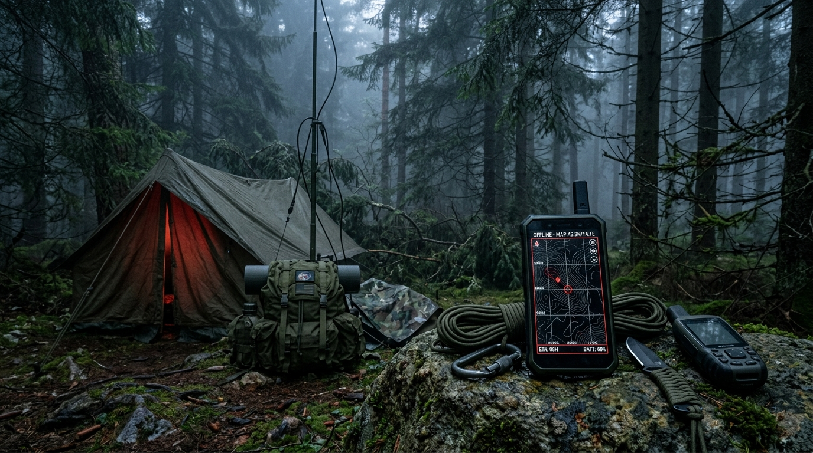
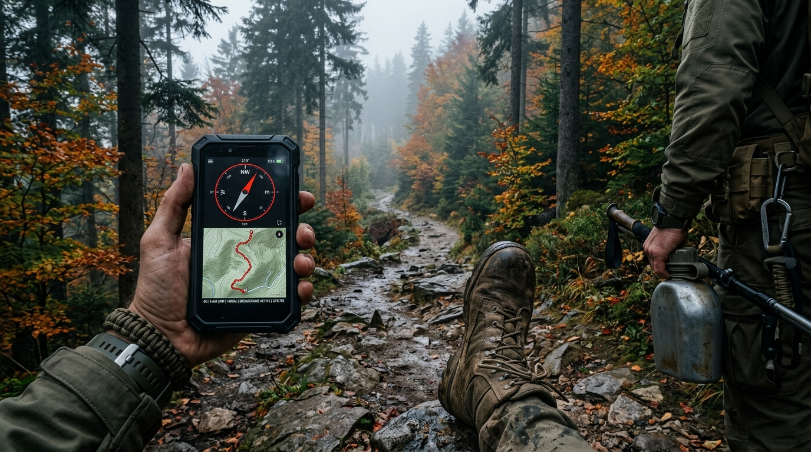
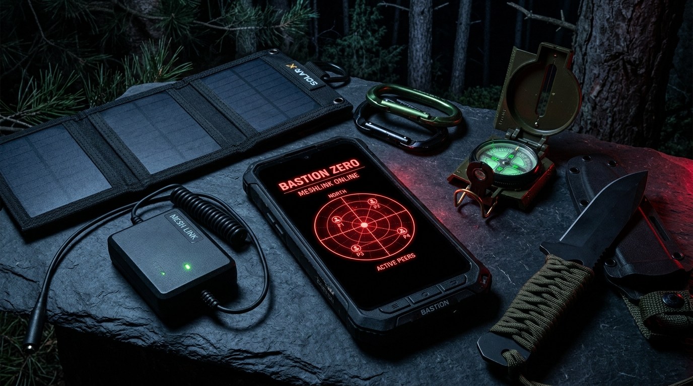
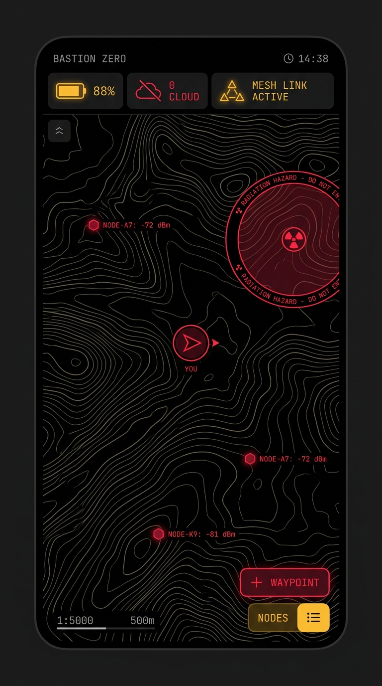
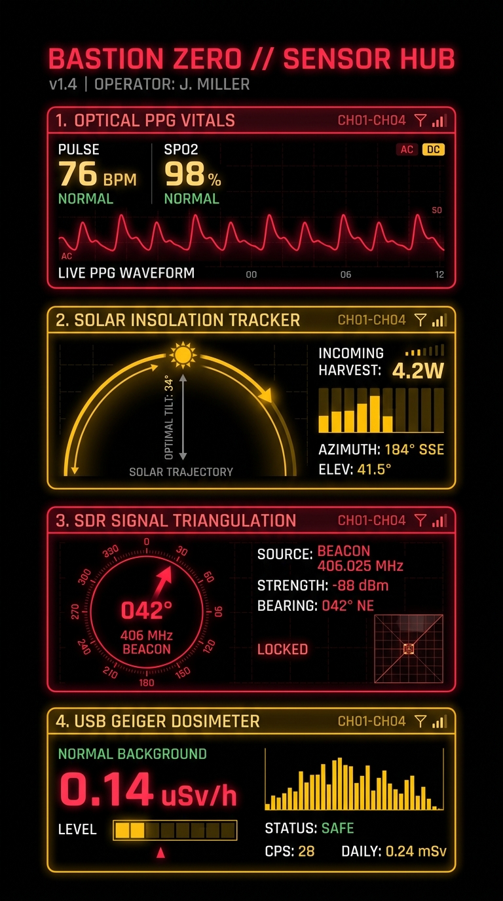
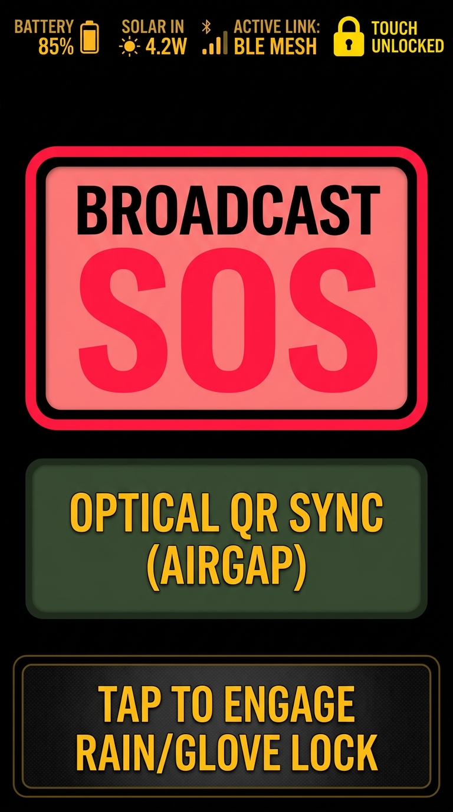
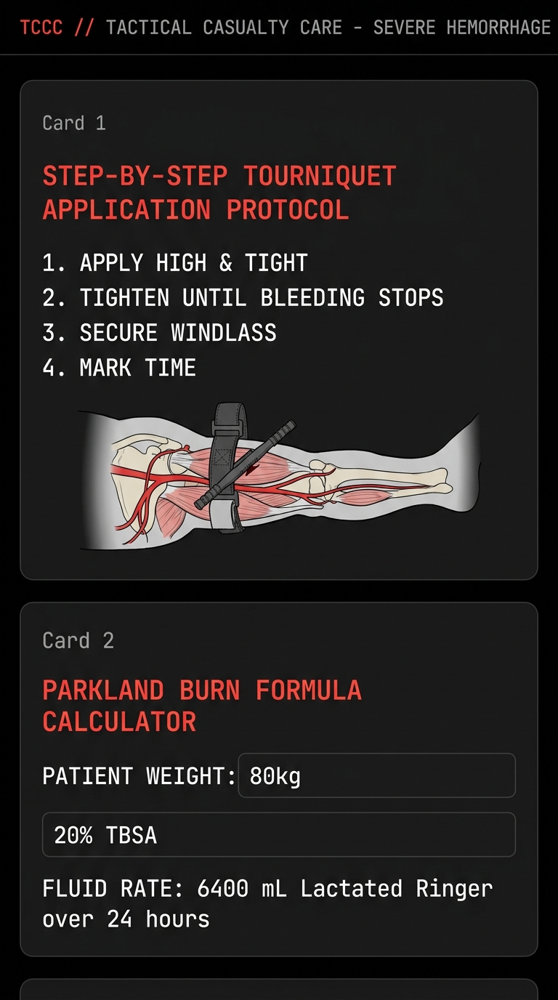

# BASTION ZERO // TACTICAL SURVIVAL DASHBOARD

<div class="tactical-hud-banner">
  <div><span class="beacon-pulse"></span>GRID STATUS: DOWN // OPERATIONAL AUTONOMY: 100%</div>
  <div>COORDS: 52°13'47"N 21°00'44"E // ALT: 112m</div>
  <div>ACTIVE PEERS: <span id="hud-peer-count" style="color:#ff3b30;font-weight:800;">4</span></div>
</div>

<div class="tactical-hero-container">
  <div class="tactical-image-frame" style="margin: 0; border: none;">
    
    <div class="hud-overlay">
      <div class="hud-title">EXPEDITION PERIMETER // SECTOR ALPHA</div>
      <div class="hud-meta">
        <span class="tactical-badge badge-red">AIR-GAPPED</span>
        <span class="tactical-badge badge-green">MESHLINK ACTIVE</span>
        <span class="tactical-badge badge-amber">OLED POWEROS 15Hz</span>
        &nbsp;· 100% OFFLINE MULTI-TOOL &amp; AD-HOC BLE MESH FOR KOTLIN MULTIPLATFORM
      </div>
    </div>
  </div>
</div>

---

## ⚡ LIVE MESHLINK SIMULATOR

Test the decentralized mesh protocol directly in your browser. Watch Lamport logical clocks increment, Ed25519 cryptographic packet signatures verify, and flood-routing relay packets across simulated forest nodes without servers.

<div class="tactical-simulator">
  <div class="tactical-hud-banner" style="background-color: #060906; border-color: #233121; margin-bottom: 12px;">
    <div>TERMINAL FEED // LOGICAL CLOCK &amp; CRDT STORE</div>
    <div style="color: #6edb5f;">STATUS: LISTENING (BLE SERVICE: 0x0000B0Z0)</div>
  </div>

  <div id="tactical-terminal-output" class="sim-screen">
    <div><span style="color:#666;">[SYSTEM READY]</span> <span style="color:#8ce980;">Bastion Zero MeshLink Initialized. Ed25519 identity key generated.</span></div>
    <div><span style="color:#666;">[TOPOLOGY]</span> Discovered 4 local nodes: <code>Node_RidgePatrol</code>, <code>Node_ForestPost_Alpha</code>, <code>Node_CampRanger</code>, <code>Node_Outpost7</code>.</div>
    <div><span style="color:#666;">[CRDT]</span> LWW-Element-Set active. 3 hazard/resource pins in local cache.</div>
  </div>

  <div class="sim-controls">
    <button class="tactical-btn btn-sos" onclick="simBroadcastSos('MEDICAL')">🚨 Broadcast SOS Medical</button>
    <button class="tactical-btn btn-sos" onclick="simBroadcastSos('RESCUE')">🚨 Broadcast SOS Rescue</button>
    <button class="tactical-btn btn-amber" onclick="simDropPin('HAZARD', 'Downed High-Voltage Powerline')">📍 Drop Hazard Pin</button>
    <button class="tactical-btn btn-amber" onclick="simDropPin('RESOURCE', 'Potable Natural Spring')">📍 Drop Resource Pin</button>
    <button class="tactical-btn" onclick="simRemoteSync()">⇄ Simulate Peer Handshake</button>
    <button class="tactical-btn" onclick="simClearLog()">✕ Clear Feed</button>
  </div>
</div>

---

## 🌲 FIELD OPERATIONS & EDGE CAPABILITIES

<div class="tactical-grid">

  <div class="tactical-card">
    <div class="tactical-image-frame" style="margin: -18px -18px 12px -18px; border-radius: 3px 3px 0 0;">
      
    </div>
    <h4>🧭 Inertial Dead Reckoning</h4>
    <p>
      When GNSS satellites are jammed, blocked by dense forest canopy, or shielded by collapsed concrete, Bastion Zero switches to pure inertial tracking.
    </p>
    <p>
      By fusing the accelerometer's Z-axis peak detection with a 9-axis Complementary Kalman Filter, it projects stride-by-stride breadcrumbs without "double-integration drift", snapping trajectories to offline vector terrain contours.
    </p>
    <div>
      <span class="tactical-badge badge-green">COMPLEMENTARY EKF</span>
      <span class="tactical-badge badge-amber">NO DRIFT</span>
    </div>
  </div>

  <div class="tactical-card">
    <div class="tactical-image-frame" style="margin: -18px -18px 12px -18px; border-radius: 3px 3px 0 0;">
      
    </div>
    <h4>📡 Tactical Hub &amp; Hardware HAL</h4>
    <p>
      Transforms smartphones into a mission-critical command console. The Hardware Abstraction Layer handles external USB-C OTG and Bluetooth survival peripherals seamlessly.
    </p>
    <p>
      Bridges BLE mesh packets across miles via 868/915 MHz LoRa nodes, visualizes FLIR microbolometer thermal imaging with emissivity correction, and tracks ionizing radiation with real-time exclusion zones.
    </p>
    <div>
      <span class="tactical-badge badge-green">LORA BRIDGE</span>
      <span class="tactical-badge badge-red">LWIR THERMAL</span>
    </div>
  </div>

  <div class="tactical-card">
    <div class="tactical-image-frame" style="margin: -18px -18px 12px -18px; border-radius: 3px 3px 0 0;">
      
    </div>
    <h4>🔋 PowerOS &amp; Perimeter Defense</h4>
    <p>
      Battery is the scarcest survival resource. PowerOS enforces a strict #000000 OLED background and #FF3B30 red typography, shutting off unlit pixels and preserving human night vision.
    </p>
    <p>
      Includes structural foundation tilt monitoring with temperature compensation, acoustic drone/rotor detection via FFT spectrograms, and a 5% Dead Man's Switch beacon broadcast.
    </p>
    <div>
      <span class="tactical-badge badge-red">OLED ZERO PIXELS</span>
      <span class="tactical-badge badge-amber">TILT MONITORS</span>
    </div>
  </div>

</div>

---

## 📱 APPLICATION INTERFACE & TACTICAL VIEWS

<div class="tactical-grid">

  <div class="tactical-card">
    <div class="tactical-image-frame" style="margin: -18px -18px 12px -18px; border-radius: 3px 3px 0 0;">
      <a href="assets/images/screenshot_mesh_map.jpg" target="_blank">
        
      </a>
    </div>
    <h4>🗺️ Tactical Mesh Map</h4>
    <p>
      Air-gapped offline vector terrain with P2P BLE mesh tracking, real-time dead-reckoning trajectory breadcrumbs, and CRDT hazard/resource pins.
    </p>
    <div>
      <span class="tactical-badge badge-green">P2P MESH</span>
      <span class="tactical-badge badge-amber">CRDT SYNC</span>
    </div>
  </div>

  <div class="tactical-card">
    <div class="tactical-image-frame" style="margin: -18px -18px 12px -18px; border-radius: 3px 3px 0 0;">
      <a href="assets/images/screenshot_sensor_hub.jpg" target="_blank">
        
      </a>
    </div>
    <h4>📡 Hardware Sensor Hub</h4>
    <p>
      Optical camera PPG pulse waveform telemetry, Kinematic Trauma impact black-box, and Geiger dosimeter serial bridge with acute exclusion zones.
    </p>
    <div>
      <span class="tactical-badge badge-red">OPTICAL PPG</span>
      <span class="tactical-badge badge-amber">GEIGER HAL</span>
    </div>
  </div>

  <div class="tactical-card">
    <div class="tactical-image-frame" style="margin: -18px -18px 12px -18px; border-radius: 3px 3px 0 0;">
      <a href="assets/images/screenshot_tactical_hud.jpg" target="_blank">
        
      </a>
    </div>
    <h4>🔴 Tactical Field HUD</h4>
    <p>
      Pure #000000 OLED night-vision red monochrome interface designed for high-stress operation, complete with 64dp glove-friendly touch targets.
    </p>
    <div>
      <span class="tactical-badge badge-red">OLED ZERO PIXELS</span>
      <span class="tactical-badge badge-green">GLOVE MODE</span>
    </div>
  </div>

  <div class="tactical-card">
    <div class="tactical-image-frame" style="margin: -18px -18px 12px -18px; border-radius: 3px 3px 0 0;">
      <a href="assets/images/screenshot_offline_wiki.jpg" target="_blank">
        
      </a>
    </div>
    <h4>🏥 Offline TCCC &amp; Medical Wiki</h4>
    <p>
      Zero-network SQLite FTS4 indexed emergency trauma library with tourniquet application guides, burn Parkland fluid calculators, and wilderness survival guides.
    </p>
    <div>
      <span class="tactical-badge badge-green">SQLDELIGHT FTS4</span>
      <span class="tactical-badge badge-red">TCCC PROTOCOLS</span>
    </div>
  </div>

</div>

---

## 🛡️ MISSION-CRITICAL ARCHITECTURE MATRIX

| Subsystem | Android Implementation | iOS Implementation | Edge-Compute Principle |
| :--- | :--- | :--- | :--- |
| **MeshLink Protocol** | Continuous Background GATT Server &amp; Client (`BluetoothLeAdvertiser` + `BluetoothLeScanner`) | Foreground Active &amp; Background Passive with dedicated Service UUID (`CoreBluetooth`) | Flood routing with decremented TTL; signed binary Protocol Buffers (&le; 200 bytes) |
| **Security &amp; Replay** | Ed25519 libsodium cryptographic signing &amp; verification | Ed25519 libsodium cryptographic signing &amp; verification | Zero wall-clock trust; Lamport logical clocks + 64-bit sliding replay window |
| **CRDT Map Sync** | LWW-Element-Set (Last-Write-Wins) with Grow-Only Confirmations | LWW-Element-Set (Last-Write-Wins) with Grow-Only Confirmations | Peer-to-peer conflict resolution for crowd-sourced hazard and resource pins |
| **Offline Knowledge** | SQLDelight SQLite with FTS4 Full-Text Search | SQLDelight Native SQLite with FTS4 Full-Text Search | Zero-network medical &amp; trauma wikis pre-ingested via Python data pipeline |
| **Power Management** | Sticky Foreground Service, timed WakeLocks, `TYPE_SIGNIFICANT_MOTION` | `BGTaskScheduler` periodic refresh &amp; battery notification hooks | Dynamic hardware throttling: 60Hz down to 10Hz, GPS intervals from 1s to 10min |

---

## 🚀 GETTING STARTED

```bash
# Clone the open-source repository
git clone https://github.com/FranekJemiolo/bastion-zero.git
cd bastion-zero

# Verify shared data core and mesh unit tests (runs on host JVM)
./gradlew :shared:testDebugUnitTest

# Assemble offline Android APK
./gradlew :androidApp:assembleDebug

# Build iOS Native Project via XcodeGen
cd iosApp && xcodegen generate && open BastionZero.xcodeproj
```

---

<div class="tactical-hud-banner" style="margin-top: 3rem; background-color: #0b110b; border: 1px solid var(--tactical-olive);">
  <div>BASTION ZERO // DESIGNED BY FRANEK JEMIOLO // OPEN SOURCE UNDER MIT LICENSE</div>
  <div><a href="https://github.com/FranekJemiolo/bastion-zero" style="color: #ff3b30; text-decoration: none; font-weight: 800;">GITHUB REPO ➔</a></div>
</div>
